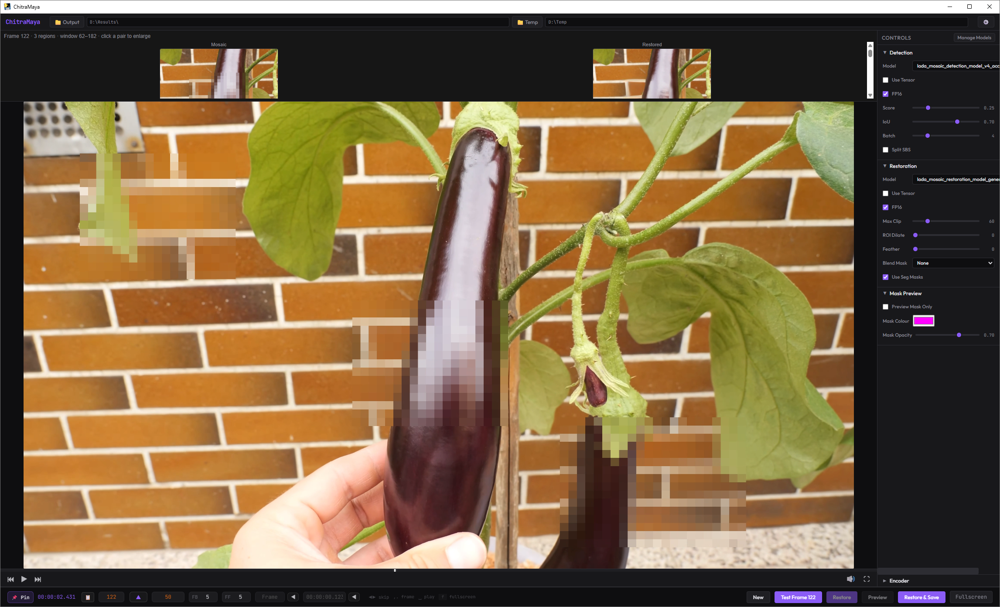
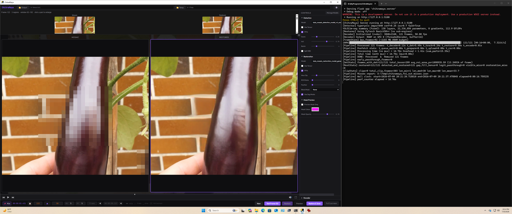
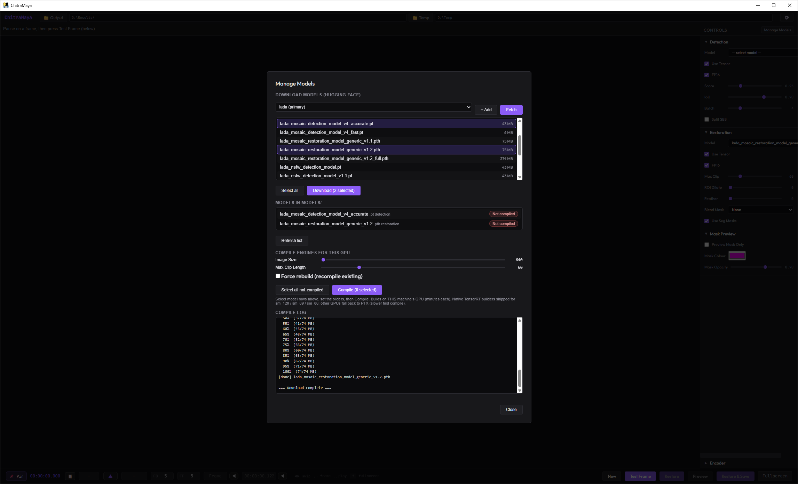
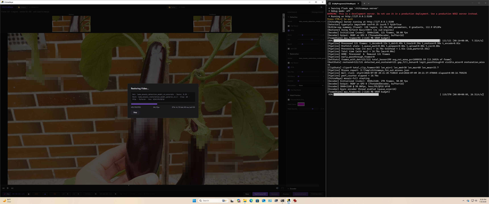
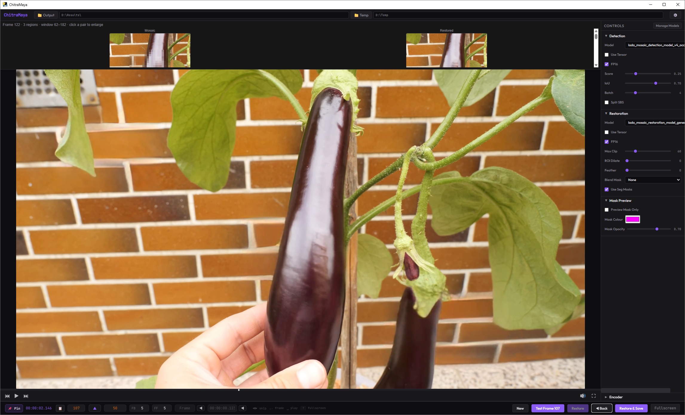

# ChitraMaya

A TensorRT-accelerated mosaic restoration studio with a real-time visual editor. Load a video, preview the restoration on your *actual* frames, and decide what to commit before spending time on a full encode.



## Terms & Conditions

By downloading or using any part of this software you agree that you will use it for only actions legally permitted in your geographic jurisdiction.
We are NOT, cannot, and will not be held responsible for any actions performed by users of this software. Users must understand and comply with all relevant local, regional, and international laws pertaining to this technology. This includes laws related to privacy, defamation, intellectual property rights, and other relevant legislation. Users should consult legal professionals if they have any doubts regarding the legal implications of their creations.


## Why ChitraMaya?

Some restoration tools are batch processors: set parameters, run a full pass, look at the result, repeat. ChitraMaya is built the other way around — as an **interactive editor**.

- **Test a single frame instantly.** Park the playhead on any frame and *Test Frame* restores a short window around it, showing each detected region as **Mosaic → Restored** side by side. Dial a setting, test again, watch it change — the loop is seconds, not a full encode.
- **Live segment preview.** Mark a segment, preview just that range, and decide whether to commit to a full run before encoding the whole video.
- **Hardware-accelerated throughout.** NVDEC decode, TensorRT-accelerated BasicVSR++ restoration, and NVENC encode keep frames on the GPU end to end.
- **Compiles for your GPU.** No models are shipped. You download the model checkpoints and compile TensorRT engines *for your specific card* — all from inside the app.



---

## Two ways to run it

- **[For Users](#for-users)** — download the installer, get models, compile, run. No Python, no build tools.
- **[For Developers](#for-developers)** — clone the repo, set up a venv, run from source, or build the installer.

---

## For Users

### 1. Requirements

- **GPU:** NVIDIA RTX card. Native TensorRT builders ship for **RTX 50-series (Blackwell), 40-series (Ada), and 30-series (Ampere)**. Other cards still work via a slower PTX fallback for the first compile.
- **OS:** Windows 10/11 with an up-to-date NVIDIA driver.
- Nothing else — CUDA, TensorRT, ffmpeg, and Python are all bundled in the installer.

### 2. Download and extract

Grab the latest release from the **[Releases](https://github.com/seatv/ChitraMaya/releases)** page. The installer is split into three parts to fit the download limit:

- `ChitraMaya-install.exe`
- `ChitraMaya-install.7z`
- `ChitraMaya-install.7z.002`

Put **ALL THREE** parts in the same folder and run `ChitraMaya-install.exe` — it reassembles and extracts automatically. You'll get a `ChitraMaya` folder containing `ChitraMaya.exe`, a `models\` folder, and `Compile-All-Engines.ps1`.

### 3. Get the models

No models ship with the app — you add them once. Two ways, both from **Manage Models** in the app (or just drop files into `models\`):

**In-app download (easiest):** launch ChitraMaya, click **Manage Models**, pick a source from the dropdown (the primary **lada** and VR-focused **zelefans** repositories are pre-loaded), click **Fetch**, select the detection (`.pt`) and restoration (`.pth`) files you want, and **Download**. They land in `models\` automatically. You can add your own Hugging Face repo URLs with **+ Add**.

> Hugging Face throttles anonymous downloads (~1,000 requests/hour per IP) and answers with a 403 once you cross it — easy to hit on a heavy day of testing across machines behind one home IP. If downloads start failing, drop a free "read" token from [huggingface.co/settings/tokens](https://huggingface.co/settings/tokens) into a one-line `hf-token.txt` next to the app (or set the `HF_TOKEN` environment variable) and retry. Failed downloads now name the cause and the fix in the log rather than showing a bare error.



**Manual:** drop any detection `.pt` and restoration `.pth` files straight into the `models\` folder.

### 4. Compile engines for your GPU

TensorRT engines are hardware-specific, so they're built on your machine (once per model):

1. Open **Manage Models**. Downloaded models show as **Not compiled**.
2. Click **Select all not-compiled** (or pick individual rows).
3. Set **Image Size** (detection; 640 is the tested default, 960 helps dense VR content) and **Max Clip Length** (restoration).
4. Click **Compile** and watch the log. This takes a few minutes per model and pins the GPU — that's normal.

When it finishes, the badges flip to **Compiled** and the models are ready to use.

> On a 6 GB card, if a restoration compile runs out of memory, that's the one thing to watch — compiling is the most VRAM-hungry step.

### 5. Restore a video

1. Load a video (drag it in or use the file picker).
2. Pick your detection and restoration models in the Control Panel. Turn on **Use Tensor** to use the compiled engines. (Every control has a tooltip — hover to learn what it does.)
3. Park the playhead on a mosaic frame and click **Test Frame** to preview the result on that frame. Adjust settings and test again until it looks right.
4. Use **Restore** / **Restore & Save** to process a segment or the whole video.

For side-by-side (SBS) VR video, enable **Split SBS** in Detection so each eye is detected at full resolution.

A few things worth knowing before a full run:

- **Max Clip Length is flexible.** A restoration engine set compiled at N handles any clip length up to N, so you can set Max Clip to any value up to your largest compiled size — the app loads the smallest set that covers your request and runs at the ceiling you asked for. Longer clips give better temporal stability but cost more VRAM.
- **VRAM pre-flight warning.** Before processing starts, ChitraMaya checks free GPU memory against what the run needs and warns you up front — from "headroom is thin" through "VRAM tight, may page" up to "this configuration does not fit this GPU" — and names the levers that would help (lower Max Clip, a smaller compiled engine set, PyTorch detection). Heed it, especially on 8 GB and smaller cards.
- **Async Encode is off by default.** Synchronous encoding is the dependable default and saves ~500–600 MB of VRAM at 4K. If your card has headroom, tick **Async Encode** in the Encoder panel to overlap encode with restoration for a faster run.





---

## For Developers

### Prerequisites

- **GPU:** NVIDIA, Turing (RTX 20xx) or newer
- **OS:** Windows 10/11 or Linux
- **Python:** 3.11 or 3.12
- **CUDA:** 12.x with matching cuDNN
- **TensorRT:** 10.x
- **ffmpeg / ffprobe:** on the system PATH (used for audio remux and CPU-decode fallback)

### Install from source

```bash
git clone https://github.com/seatv/ChitraMaya.git
cd ChitraMaya

python -m venv venv
# Windows
venv\Scripts\activate
# Linux
source venv/bin/activate

pip install -r requirements.txt
pip install -e .
```

Models are not shipped; place detection `.pt` and restoration `.pth` files in `models/` (compiled engines are cached in `models/engines/`).

### Compile engines

Compile everything found in `models/` in one shot:

```powershell
# Windows (defaults: DetImgsz 640, DetMaxBatch 8, workspace 2 GB, fp16 on)
powershell -ExecutionPolicy Bypass -File .\Compile-All-Engines.ps1
# Low-VRAM cards, if a compile OOMs:
powershell -ExecutionPolicy Bypass -File .\Compile-All-Engines.ps1 -RestWorkspace 1
```

Or compile individually:

```bash
chitramaya -compile-det  --det-model  models/<detection_model>.pt    --det-imgsz 640
chitramaya -compile-rest --rest-model models/<restoration_model>.pth --rest-max-clip-length 60
```

### Run

```bash
# Interactive UI (default)
chitramaya

# Headless CLI
chitramaya -restore \
    --input video.mp4 \
    --output restored.mp4 \
    --det-model  models/<detection_model>.pt \
    --rest-model models/<restoration_model>.pth \
    --rest-max-clip-length 60 \
    --rest-backend trt
```

Useful CLI flags:

| Flag | Description |
|---|---|
| `--rest-backend` | `auto` (default — loads a covering engine set, or falls back to PyTorch), `trt` (force TensorRT sub-engines), or `pytorch` (force fallback, no precompiled engines needed) |
| `--rest-max-clip-length` | Frames per restoration clip. Any value up to your largest compiled set — the app loads the smallest set that covers it and runs at this ceiling. Defaults to 30 if omitted. |
| `--det-conf` | Detection confidence threshold |
| `--det-imgsz` | Detector input size (multiple of 32). This is the only way to run detection at a size other than 640 — see Known Issues. |
| `--async-encoder` | Overlap encode with restoration (opt-in; synchronous is the default). Faster on cards with VRAM headroom. |
| `--enc-codec` | Output codec: `hevc` or `h264` |
| `--enc-qp` | Encoder quantization parameter (lower = higher quality) |
| `--mp4-fast-start` / `--no-mp4-fast-start` | Move the MP4 index to the front for streaming (on by default) |
| `--max-frames` | Process at most N frames (debug) |

Run `chitramaya -restore --help` for the full list. A handful of no-op flags from earlier versions (`--enc-format`, the `--vis-*` overlay flags, `--profile-sync`, and two `--rest-compositor-*` flags) were removed in v1.1; every flag that remains has a real effect.

### Build the installer

```powershell
# From the repo root, in your release venv:
powershell -ExecutionPolicy Bypass .\packaging\windows\chitramaya-packager.ps1
```

This produces a split, self-extracting installer under `dist\`. TensorRT builder resources are trimmed to the shipped consumer architectures (plus PTX) to keep the size down; edit `_DROP_TRT_BUILDER_ARCHS` in `packaging\windows\chitramaya.spec` to change which GPUs are supported natively.

---

## Architecture

```
Decode (NVDEC) -> Detect (YOLO) -> Track scenes -> Restore (BasicVSR++ / TensorRT) -> Composite -> Encode (NVENC)
```

A YOLO detector locates mosaic regions per frame, a scene tracker groups them into temporally coherent clips, and a BasicVSR++ restoration model (run through TensorRT sub-engines, or a PyTorch fallback) reconstructs each clip with temporal consistency. Restored regions are composited back into the frame — with an optional **FaceFusion** blend that follows the mosaic's actual shape for a softer edge.

Full restores stream the whole file through NVDEC for throughput; *Test Frame* and segment previews read just the frames they need.

## Known Issues / Not Yet Implemented

A few things are intentionally incomplete or have known limitations in this release:

**Not yet implemented (flags parse but have no effect):**

- **Batch / folder processing** — `--batch-video-extensions` and `--batch-skip-existing` are placeholders; ChitraMaya currently processes one input at a time. Batch-over-a-folder isn't wired yet.
- **Detection debug dumps** — `--debug-save-detection-frames` and `--debug-save-detection-json` don't write anything yet.

**Known limitations:**

- **Detection Image Size is UI-selectable only at compile time.** You can compile a detection engine at 960 (or any multiple of 32) from **Manage Models**, but the UI restore path always detects at 640. To *run* at a non-640 size, drive it from the CLI with `--det-imgsz` until the runtime UI control lands.
- **Detection FP16 applies only to the PyTorch path.** For a compiled TensorRT detection engine, precision is baked in at compile time, so the runtime **Detection FP16** toggle has no effect — the app now grays it out when a compiled engine is selected. It still applies to `.pt` PyTorch detection runs.
- **Test Frame preview rows can accumulate.** Running **Test Frame** repeatedly on the same frame may stack preview rows in the strip until you press **New** or the next result replaces them. Cosmetic; a fix is planned.

Found something else? Please open an issue — **without** attaching any explicit content (see the issue template).

## License

See [LICENSE](LICENSE) for details.
