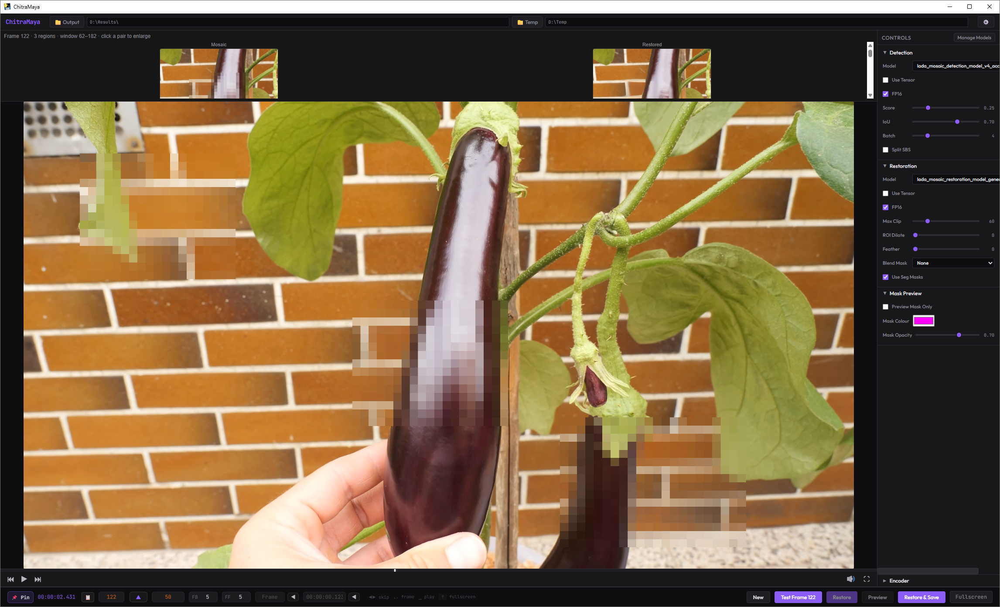
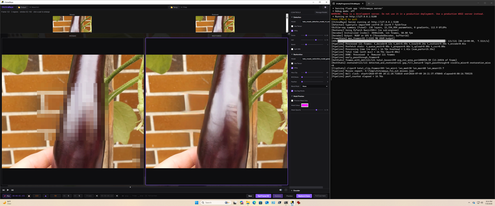
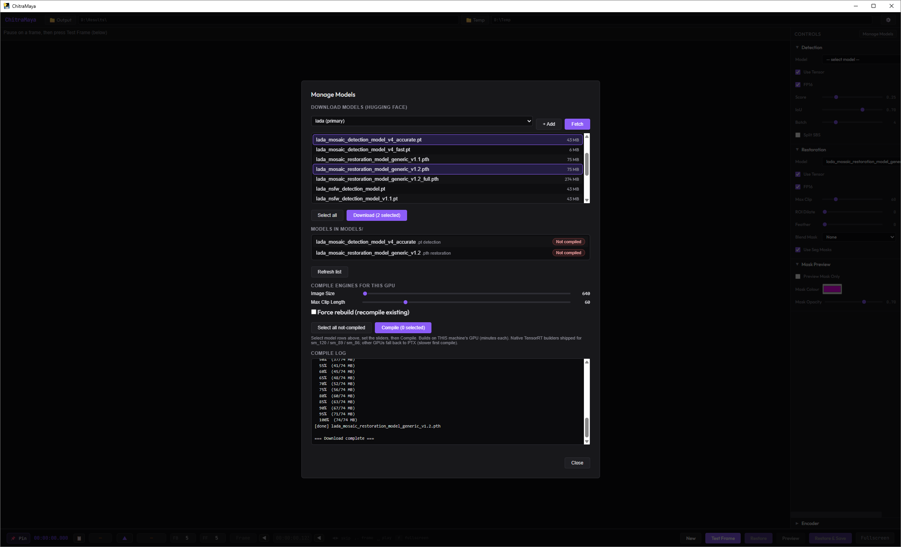
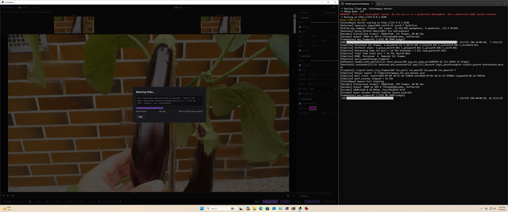
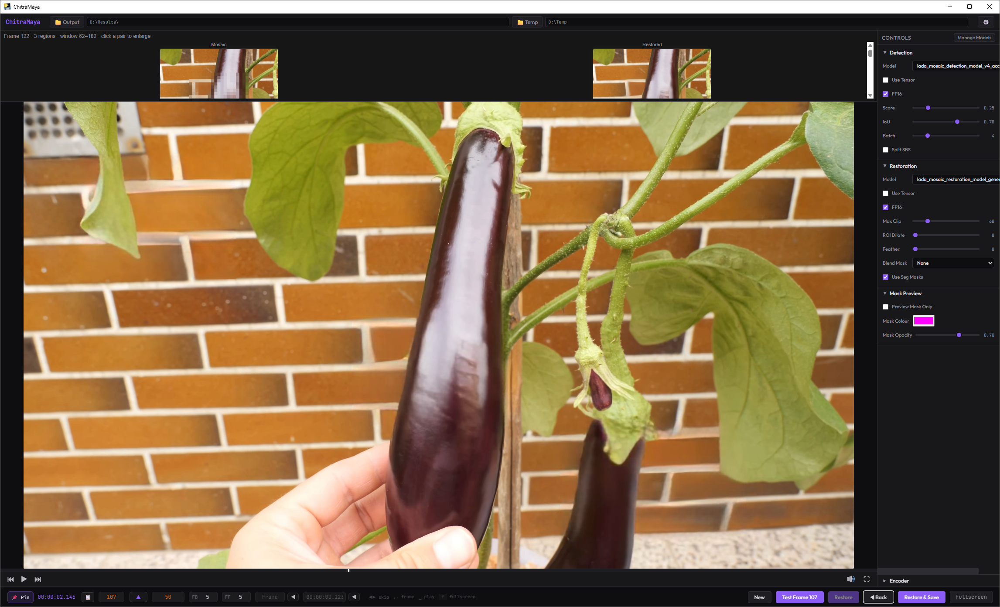

# ChitraMaya

A TensorRT-accelerated mosaic restoration studio with a real-time visual editor. Load a video, preview the restoration on your *actual* frames, and decide what to commit before spending time on a full encode — or point it at a whole folder and let it work through the queue.

Built for NVIDIA RTX cards — with **experimental editions for AMD Radeon (ROCm)** and **Intel Arc** (see [the AMD edition](#amd-radeon-rocm-edition--experimental) and [the Intel Arc edition](#intel-arc-xpu-edition--experimental)).



## Why ChitraMaya?

Some restoration tools are batch processors: set parameters, run a full pass, look at the result, repeat. ChitraMaya is built the other way around — as an **interactive editor** that can also batch.

- **Test a single frame instantly.** Park the playhead on any frame and *Test Frame* restores a short window around it, showing each detected region as **Mosaic → Restored** side by side. Dial a setting, test again, watch it change — the loop is seconds, not a full encode. The enlarged view keeps your **last 5 attempts on that frame**, so you can flip between settings variants with one click and pick the winner by eye.
- **Process a whole folder.** *Process Folder* queues every video in a folder with your current settings — models load once, each file runs isolated (one failure can't kill the batch), finished outputs are skipped on re-run, and existing files are never overwritten.
- **Two-stage restoration quality.** An optional **RTX Super-Res** second stage upscales restored regions before paste-back so large close-up regions stop going soft, and a **Temporal Stability** stage removes frame-to-frame shimmer from restored regions — both recommended, both a single dropdown.
- **Live segment preview.** Mark a segment, preview just that range, and decide whether to commit to a full run before encoding the whole video.
- **Hardware-accelerated throughout.** NVDEC decode, TensorRT-accelerated BasicVSR++ restoration, and NVENC encode — to **HEVC, H.264, or AV1** — keep frames on the GPU end to end. (On Intel Arc: Quick Sync decode and encode, with PyTorch restoration — see the Arc section.)
- **A clean windowed app.** No terminal window: console output lives in an in-app Console panel and in `ChitraMaya-console.log` next to the exe. (Terminal fans: `ChitraMaya-cli.exe` is the same app with live console output for headless runs and compiles.)
- **Compiles for your GPU.** No models are shipped. You download the model checkpoints and compile TensorRT engines *for your specific card* — all from inside the app.
- **Made for VR/SBS content.** Per-eye detection for side-by-side video, a runtime **Image Size** dial for dense high-resolution frames, **VR Projection** for studios whose mosaic arrives warped in the raw frame, and **SBS View**: a projected look-around preview (like a headset, on your desktop) with a draggable wipe to compare original vs restored inside the projection.
- **Add Mosaic.** The inverse operation — pixelate regions to produce shareable SFW clips. Draw rectangles by hand (precise, reliable), or let the app auto-detect regions with a detection model (**experimental** — see the warning below).



## Terms & Conditions

By downloading or using this software, in whole or in part, you agree to use it only for purposes that are lawful in your jurisdiction.

You are solely responsible for what you create with it and for complying with all applicable local, regional, and international laws — including, without limitation, those governing privacy, consent, publicity, defamation, and intellectual property. The authors and contributors of this software accept no responsibility and shall not be held liable for any use of the software or for anything produced with it. If you are unsure whether a use is lawful where you are, consult a legal professional before proceeding.

> [!CAUTION]
> **Automatic mosaic detection is experimental and must not be relied on to censor content.** The "Auto-detect" / censor mode uses a third-party NSFW detection model that does **not** reliably find all explicit content — it will miss regions and whole frames. Do not use it to make content safe for publication, distribution, or any purpose where missed content has consequences. For censoring you can trust, use the **manual draw-rectangles** Add Mosaic, apply the **two-pass leak check** described in the Add Mosaic section, and **review every frame of the output yourself** before sharing. See [Known Issues](#known-issues--not-yet-implemented).

---

## Two ways to run it

- **[For Users](#for-users)** — download the installer, get models, compile, run. No Python, no build tools.
- **[For Developers](#for-developers)** — clone the repo, set up a venv, run from source, or build the installer.

**AMD Radeon or Intel Arc owner?** The NVIDIA instructions below don't apply to you — jump to **[the AMD edition](#amd-radeon-rocm-edition--experimental)** or **[the Intel Arc edition](#intel-arc-xpu-edition--experimental)**.

---

## For Users

### 1. Requirements

- **GPU:** NVIDIA RTX card. Native TensorRT builders ship for **RTX 50-series (Blackwell), 40-series (Ada), and 30-series (Ampere)**. Other cards still work via a slower PTX fallback for the first compile. **AV1 output** additionally requires an RTX 40-series or newer (older cards can decode AV1, but only Ada/Blackwell NVENC can encode it — the app checks and tells you). The optional **RTX Super-Res** second stage needs an RTX card with a recent NVIDIA driver. *(AMD Radeon and Intel Arc cards: see [the AMD edition](#amd-radeon-rocm-edition--experimental) and [the Arc edition](#intel-arc-xpu-edition--experimental) — each is a separate download.)*
- **OS:** Windows 10/11 with an up-to-date NVIDIA driver.
- Nothing else — CUDA, TensorRT, ffmpeg, and Python are all bundled in the installer.

### 2. Download and extract

Grab the latest release from the **[Releases](https://github.com/seatv/ChitraMaya/releases)** page.

> [!CAUTION]
> ### ⚠️ The NVIDIA installer is $${\color{red}THREE}$$ files — you need $${\color{red}ALL\ THREE}$$.
>
> The `.exe` **by itself is not the program**; it is only the unpacker for the
> other two parts. Download **all three** into the **same folder**:
>
> - [ ] `ChitraMaya-install.7z.001`
> - [ ] `ChitraMaya-install.7z.002`
> - [ ] `ChitraMaya-install.exe`
>
> *(The AMD and Intel Arc editions are different: each is **one**
> `*-install.exe` you double-click — see their sections.)*

Run `ChitraMaya-install.exe` — it reassembles the parts and extracts automatically. You'll get a `ChitraMaya` folder containing `ChitraMaya.exe`, `ChitraMaya-cli.exe`, a `models\` folder, and `Compile-All-Engines.ps1`. If the install fails immediately, check that all three downloads completed and are in one folder.

**Which exe?** `ChitraMaya.exe` is the app — windowed, no terminal; its console output goes to the in-app Console panel and to `ChitraMaya-console.log` next to the exe (the previous run is kept as `ChitraMaya-console.prev.log`). `ChitraMaya-cli.exe` is the same app for **terminal workflows** — headless restores and engine compiles in PowerShell, with live output and progress bars.

### 3. Get the models

No models ship with the app — you add them once. Two ways, both from **Manage Models** in the app (or just drop files into `models\`):

**In-app download (easiest):** launch ChitraMaya, click **Manage Models**, pick a source from the dropdown (the primary **lada** and VR-focused **zelefans** repositories are pre-loaded), click **Fetch**, select the detection (`.pt`) and restoration (`.pth`) files you want, and **Download**. They land in `models\` automatically. You can add your own Hugging Face repo URLs with **+ Add**.

> Hugging Face throttles anonymous downloads (~1,000 requests/hour per IP) and answers with a 403 once you cross it — easy to hit on a heavy day of testing across machines behind one home IP. If downloads start failing, drop a free "read" token from [huggingface.co/settings/tokens](https://huggingface.co/settings/tokens) into a one-line `hf-token.txt` next to the app (or set the `HF_TOKEN` environment variable) and retry. Failed downloads now name the cause and the fix in the log rather than showing a bare error.



**Manual:** drop any detection `.pt` and restoration `.pth` files straight into the `models\` folder.

*(The Temporal Stability weights are the one exception to "no models ship" — they're tiny, Apache-2.0-licensed, and bundled inside the app, so that feature works out of the box.)*

### 4. Compile engines for your GPU

TensorRT engines are hardware-specific, so they're built on your machine (once per model):

1. Open **Manage Models**. Downloaded models show as **Not compiled**.
2. Click **Select all not-compiled** (or pick individual rows).
3. Set **Image Size** (detection; 640 is the tested default — **compile at 800 if you mostly restore 4K+ VR/SBS content**, see the tuning note below) and **Max Clip Length** (restoration — **60 on an 8 GB card**, see the VRAM rule below).
4. Click **Compile** and watch the log. This takes a few minutes per model and pins the GPU — that's normal.

When it finishes, the badges flip to **Compiled** and the models are ready to use.

> On a 6 GB card, if a restoration compile runs out of memory, that's the one thing to watch — compiling is the most VRAM-hungry step.

### 5. Restore a video

1. Load a video (drag it in or use the file picker). The top bar shows the **full path of the loaded file**, so a long batch session never leaves you guessing which file is on screen.
2. Pick your detection and restoration models in the Control Panel. Turn on **Use Tensor** to use the compiled engines. (Every control has a tooltip — hover to learn what it does.)
3. Park the playhead on a mosaic frame and click **Test Frame** to preview the result on that frame. Adjust settings and test again until it looks right — the enlarged view keeps your last 5 attempts on that frame; flip between them with the ‹ › arrows or jump with the numbered slots (hover a number to see which settings produced it).
4. Use **Restore** / **Restore & Save** to process a segment or the whole video.

**The two quality dials worth turning on (Restoration panel):**

- **Secondary → RTX Super-Res 2× / 4× (recommended).** The restorer works on a fixed-size crop; regions *larger* than that used to be stretched at paste-back and went soft — worst on close-ups and VR. With Super-Res on, the restored crop is upscaled first so the final resize shrinks instead of stretching. Costs ~4% run time; small regions automatically keep the untouched path. Needs an RTX card and a recent driver (bundled runtime; the app tells you if it's unavailable and runs as before).
- **Temporal Stability → 2 (recommended).** Removes the frame-to-frame shimmer restoration models produce, smoothing each restored region across a 7-frame window only where content agrees — real motion passes through. Only restored pixels are touched. Weights are bundled; there's nothing to download. Especially worthwhile on 8 GB cards, where shorter clip lengths make shimmer more visible.

> [!IMPORTANT]
> ### The 8 GB VRAM rule
> On an **8 GB card**, use **Max Clip Length 60** (90 is fine too) and **encoder preset P5**. The key fact: a TensorRT engine set reserves VRAM for the clip size it was **compiled** at, not the Max Clip value you dial — selecting MCL 60 while only a 180-frame set is compiled still pays the 180-frame memory bill. So **compile a set for each Max Clip value you actually use** (30/60/90 — Manage Models, one compile each); the app always loads the *smallest* compiled set that covers your dial. From v1.50.00 the console warns you **before the run starts** if the set about to load is too big for your card, and checks encoder headroom after models land — heed both. Sets of 90 and below run the full quality stack comfortably on 8 GB; 120 is marginal; 180 needs 16 GB. **12 GB+ cards:** run MCL 90+ freely; our field data says the extra clip length is worth having.

A few more things worth knowing before a full run:

- **Max Clip Length is flexible.** A restoration engine set compiled at N handles any clip length up to N, so you can set Max Clip to any value up to your largest compiled size — the app loads the smallest set that covers your request and runs at the ceiling you asked for. Longer clips give better temporal stability but cost more VRAM.
- **Full-clip restoration on the PyTorch path (v1.50.00).** With **Use Tensor** off, the Max Clip dial unlocks up to **600 frames** and the restorer propagates detail across the whole window in one pass — the dial *is* the temporal window there, limited only by memory. If a long window doesn't fit, add `"restoreChunkFrames": 32` to `ChitraMaya-config.json` (or `--restore-chunk-frames 32`) to restore the old chunked behavior.
- **Two copies at once is fine.** Launching a second instance automatically picks the next port (the console says so) and writes its own `ChitraMaya-console-<pid>.log`, so parallel sessions don't fight over one log file.
- **VRAM pre-flight warning.** Before processing starts, ChitraMaya checks free GPU memory against what the run needs and warns you up front — from "headroom is thin" through "VRAM tight, may page" up to "this configuration does not fit this GPU" — and names the levers that would help (lower Max Clip, a smaller compiled engine set, PyTorch detection). Heed it, especially on 8 GB and smaller cards.
- **Async Encode is off by default.** Synchronous encoding is the dependable default and saves ~500–600 MB of VRAM at 4K. If your card has headroom, tick **Async Encode** in the Encoder panel to overlap encode with restoration for a faster run.
- **Output codec.** The Encoder panel offers **HEVC** (default), **H.264**, and **AV1** (RTX 40-series or newer). Your **QP** setting always uses the familiar HEVC 0–51 scale; for AV1 the app maps it internally to AV1's finer quantizer scale (the log shows the mapping), so QP 18 means the same quality intent regardless of codec. AV1 outputs are automatically post-processed so they seek correctly in every player (a hardware-encoder quirk ChitraMaya repairs at packaging time). The **Preset** dropdown offers the full P1 (fastest) to P7 (best) ladder — on 8 GB cards stay at **P5 or below**.
- **Outputs never overwrite.** If the output name already exists, the new file gets a `-2`, `-3`, … suffix and the log says so.
- **Stall protection.** A watchdog monitors long runs and calls out a stalled pipeline instead of letting it sit silently. On eGPU setups it also warns if the PCIe link is running below its trained speed *under load* — an early warning for VRAM-paging trouble. The stall threshold is configurable: add `"watchdogStallSeconds": 300` to `ChitraMaya-config.json` (next to the exe) if the default 120 seconds is too eager for your hardware.
- **The system stays awake during runs.** ChitraMaya holds off the idle-sleep timer while processing (the display may still turn off), then releases it — overnight runs no longer die to a power plan.





### 6. Process a whole folder

**Process Folder** (Alternate Execution Modes) runs your current settings over every video in a folder:

1. Pick the folder (paths pasted from Explorer work, quotes and all), optionally recursive, and choose the output location and suffix.
2. The queue modal shows every file, tells you which will be **skipped and why** (usually: output already exists — that's your resume mechanism), and processes the rest one by one with a live status and elapsed clock per file.
3. Models load once and stay warm for the whole batch. Each file runs isolated — a failure on one file (even a GPU hang; the watchdog catches it) is logged and the batch moves on.
4. Everything the batch did is in the console log, including a per-file summary at the end.

Headless: pass a **folder** to `--input`, with `--batch-video-extensions` and `--batch-skip-existing` to control selection.

### 7. VR / SBS content — the dials that matter

For side-by-side (SBS) VR video, enable **Split SBS** in Detection so each eye is detected at full resolution. Then two more dials decide how good the result gets:

**Image Size (Detection).** The detector's input resolution, adjustable at runtime (640–960, steps of 32). On 4K-and-up VR frames the default 640 downscales too aggressively and can miss small or faint mosaics; **800 is the field-tested sweet spot for ≥4K VR/SBS** (640 missed frames in our tests; 800 and 960 caught everything, and 960 fragments clips without adding catches). With **Use Tensor** on, the compiled engine must match this size — if it doesn't, the run automatically falls back to PyTorch at your requested size and the log tells you to recompile the engine at that size in Manage Models. For regular flat content, 640 remains the tested default.

**VR Projection (Detection).** Some VR studios apply the mosaic to the raw video frame; others apply it in *viewing* space, so it looks square in a headset but arrives warped and trapezoidal in the raw frame — a pattern the detection and restoration models were never trained on and handle poorly. The **VR Projection** dropdown (requires Split SBS) fixes the second kind: with **Fisheye** selected, each eye is warped so those blocks become square again, detection and restoration run in that space, and only the restored regions are warped back onto the untouched original frames — background pixels are never resampled.

*Which setting for which video?* Open the video in any flat player (PotPlayer, VLC — no VR mode) and look at the mosaic:

- Blocks form a clean, even grid of **squares** → leave VR Projection **Off**. (Warping this content would hurt.)
- Blocks look **warped** — trapezoidal cells, rows that bow or fan out, especially away from the center → set VR Projection to **Fisheye**.

> [!IMPORTANT]
> On warped-mosaic content with projection Off, the run statistics can look perfect (every frame "detected and restored") while the output still shows mosaic — the models latch onto the warped blocks but cannot actually reconstruct them. **Judge quality with your eyes, not the stats:** use **Test Frame** on a mosaic-heavy frame with projection Off vs Fisheye and compare.

> VR bonus: the RTX Super-Res secondary is at its most valuable on VR content — close-up regions there are routinely far larger than the restorer's native crop.

### 8. Compare in 3D — SBS View

For side-by-side VR content, the flat player shows two distorted fisheye-looking halves. **SBS View** (the button next to the volume control) projects the video the way a headset would — a natural look-around view — and lets you compare the original against your restored output side by side *inside* that projection.

It helps to understand the two independent choices in the top bar, because they answer different questions:

- **Eye (L / R)** — *which eye's image am I inspecting?* SBS video carries two pictures; this picks one. Your choice applies to everything on screen at once.
- **View (Original / Restored / Wipe)** — *which video fills the screen?* **Original** is the loaded video, **Restored** is your most recent output (run a restore, or Add Mosaic, first — until then only Original is available), and **Wipe** shows both at once, split by a draggable divider: **original on the left of the divider, restored on the right**. The divider splits the two *videos*, not the two eyes.

So "Eye = L, View = Wipe" means: show the left eye's picture, original left of the divider, restored right of it. Drag the divider across a restored region and watch it flip between mosaic and clean — that's the money shot.

Everything else in one place:

- **Look around:** drag with the mouse. **Zoom:** mouse wheel (FOV 30–110). **Reset view** or `0` recenters.
- **Playback:** both videos play together, frame-locked. Space = play/pause; `«  ‹  ›  »` buttons (or ←/→ arrows) skip by your configured skip amounts; `,` / `.` step a single frame; `m` unmutes (audio comes from the restored side). The `fN` counter in the time display is the current frame number.
- **Speed** (0.1×–1×): slow motion for close inspection — and if a very large original struggles to keep up with the restored side, a slower speed lets it stay in sync.
- **Offset:** aligns the clocks when the restored side is a *segment* preview (its 0:00 is the segment start). Auto-filled; you rarely need to touch it.
- **Esc** closes and frees the viewer's decoders.

> SBS View is a desktop editing aid, not a headset mode — for viewing in VR, open the output file in your usual VR player. It currently assumes equirect-180 side-by-side (left|right) content. (VR Projection affects *restoration*; a matching projection selector for this viewer is planned.)

### 9. Add Mosaic — make SFW clips

The inverse of restoration: pixelate regions and save, for producing shareable, safe-for-work clips (this project's own demo material is made with it). There are two ways to place the mosaic — a **reliable manual** way and an **experimental automatic** way.

**Manual (reliable) — draw the rectangles.**

1. Load a video; optionally mark a segment to limit the scope.
2. Click the **Add Mosaic** button. The player pauses and a crosshair appears — **drag rectangles directly on the video** (up to three). Each shows its size and a ✕ to remove it. You can still scrub the timeline to a better frame while drawing.
3. For SBS video (with **Split SBS** on), draw on *either* eye — a dashed ghost mirrors the rectangle to the other eye at the same per-eye position, and both eyes get mosaiced.
4. **Done** opens a dialog with the exact pixel coordinates for fine-tuning (**Draw again** goes back to the video with your rectangles intact). Set **Block** for the mosaic cell size (16 is the classic look).
5. **Add & Save** encodes to `<name>-mosaic.mp4` (or `-mosaic-seg.mp4` for a segment) in your output folder. The result becomes the preview — open **SBS View** and wipe-compare original vs censored to verify placement in both eyes.

**Automatic (experimental) — let a model find the regions.**

> [!CAUTION]
> **This is experimental and will miss content. Do not use it to censor anything you intend to share.** It depends on a third-party NSFW detection model whose accuracy is limited — it misses regions and whole frames, and it is *not* production-grade. Treat any automatic result as a rough draft that **you must review frame by frame**, and fix by hand. When it matters, use the manual method above.

Auto mode reuses the detection pipeline: pick a detection model (e.g. an NSFW detector) as the **Detection** model, then under **Alternate Execution Modes** in the Control Panel tick **Add Mosaic** and set **Block**. Now **Test Frame** shows each detected region as **Original → Censored** (the fast way to see what the model catches and misses on a given frame), **Restore** previews a censored segment, and **Restore & Save** writes `<name>-censored.mp4`. A detection model is all it needs — no restoration model.

**Field-proven technique #1 — max-recall settings.** For censoring, over-coverage is safe and a miss is not. Run detection with **Score 0.05** and **IoU 1.0**. The IoU dial controls how aggressively overlapping candidate boxes are merged — it is *not* a sensitivity dial — and at 1.0 every candidate region is kept, which is exactly the right bias when missing something has consequences.

**Field-proven technique #2 — the two-pass leak check.** After censoring, run the same detector **over the censored output** (Test Frame or a preview pass). Any frame where it still detects something is a leak candidate — go patch those frames with manual rectangles and re-save. This converts "scrub the whole file slowly and hope" into a short, targeted checklist. It is not a guarantee — a final review with your own eyes (playback-speed control + SBS View wipe) is still mandatory before sharing anything.

---

## AMD Radeon (ROCm) Edition — EXPERIMENTAL

> [!CAUTION]
> **Very early field coverage.** The AMD edition has so far been validated
> on a small number of machines (first field card: an RX 9060 XT — clean
> self-check and the app runs; broader restore mileage is still
> accumulating). It may work well on your card; it may not. Use with
> caution and please report what you find.

The AMD edition is a **separate download** — a single **`ChitraMaya-rocm-install.exe`**: double-click, pick a folder, and run `ChitraMaya.cmd` from the extracted folder. Do not mix it with the NVIDIA install.

**How it differs from the NVIDIA edition:**

- **Requires Adrenalin driver 26.2.2 or newer.** Earlier drivers lack the runtime the bundled PyTorch ROCm stack needs.
- **No engine compiling.** TensorRT does not exist here — models run directly in PyTorch (and from v1.50.00, with the full-clip temporal window: the biggest quality change this edition has received). Manage Models still downloads the `.pt`/`.pth` checkpoints; there is simply no compile step.
- **ffmpeg does decode and encode** (AMD AMF hardware encoders where available).
- **NVIDIA-only features say so and step aside:** RTX Super-Res and the PCIe monitor are unavailable by design. Temporal Stability works fully.
- Everything else — the editor, Test Frame, Process Folder, Add Mosaic, SBS View, the watchdog, keep-awake, crash hardening — is the same product.

**Reporting problems:** attach `ChitraMaya-console.log` and the `*.misses.json` beside your output, and state your GPU model, driver version, and Resizable BAR state. Run `ChitraMaya-cli.exe -self-check` and include its output — from v1.50.00 it reports your card's VRAM too. No explicit content in issues, per the issue template.

---

## Intel Arc (XPU) Edition — EXPERIMENTAL

> [!CAUTION]
> **Tested on exactly one machine and one card:** an Arc A580 8GB
> (Alchemist) on Windows 11, without Resizable BAR. Every other Intel
> GPU — A750/A770, B-series (Battlemage), iGPUs — is **untested**. It
> may work; it may not. Use with caution, expect rough edges, and
> please report what you find.

The Arc edition is a **separate download** — a single `ChitraMaya-xpu-install` file (an `.exe` installer from v1.50.00 on: double-click, pick a folder; earlier releases were a plain `.7z` you extract yourself). Run `ChitraMaya.cmd` from the extracted folder. Do not mix it with the NVIDIA install.

**What works (field-validated on the test machine):** the complete product path — detection, BasicVSR++ restoration, Temporal Stability, encode — on the Arc; **Quick Sync hardware decode** (with D3D11VA and CPU fallbacks — the console tells you which was picked) and **Quick Sync hardware encode** (AV1, HEVC, H.264); crash hardening (a failed run still yields a playable partial output plus a `*.misses.json` diagnostic report with the console tail embedded); the stall watchdog, VRAM telemetry, and keep-awake for long runs.

**What to expect:**

- **It is slow.** On the same 4K test file, the A580 ran about **20× slower** than a comparable NVIDIA card (RTX 3060: 58 seconds; A580: 18 minutes). This is a software-maturity gap in PyTorch's Intel support, not a defect in your card or setup. Plan runs accordingly.
- **No engine compiling.** TensorRT does not exist here — models run directly in PyTorch. Manage Models still downloads the `.pt`/`.pth` checkpoints; there is simply no compile step (and no `Compile-All-Engines.ps1`).
- **NVIDIA-only features degrade gracefully and say so:** RTX Super-Res and the PCIe monitor are unavailable on Arc by design.
- **8 GB Arc cards handle 4K flat video** with ~40% VRAM headroom. 5K/VR/SBS content is currently **not recommended** on 8 GB.
- **Requirements:** Windows 10/11 and a current **Intel graphics driver** — nothing else; ffmpeg and all runtimes are bundled. Resizable BAR on is recommended (BIOS: CSM off, Above 4G Decoding on, ReBAR on), with the caveat that the test machine ran *without* it, so ReBAR configurations are themselves untested.
- **Troubleshooting:** add `"hwDecode": "off"` to `ChitraMaya-config.json` (next to the exe) to force CPU decode if you suspect a hardware-decode problem with a file. Valid values: `auto` (default), `qsv`, `d3d11va`, `off`.

**Reporting problems:** please attach `ChitraMaya-console.log` (next to the exe) and the `*.misses.json` written beside your output — it contains the run settings, statistics, and the last console lines. State your GPU model, driver version, and whether Resizable BAR is enabled (GPU-Z shows this). No explicit content in issues, per the issue template.

---

## For Developers

### Prerequisites

- **GPU:** NVIDIA, Turing (RTX 20xx) or newer — or Intel Arc (see below)
- **OS:** Windows 10/11 or Linux
- **Python:** 3.11 or 3.12
- **CUDA:** 12.x with matching cuDNN *(NVIDIA path)*
- **TensorRT:** 10.x *(NVIDIA path)*
- **ffmpeg / ffprobe:** on the system PATH (used for audio remux and decode paths)

### Install from source

```bash
git clone https://github.com/seatv/ChitraMaya.git
cd ChitraMaya

python -m venv venv
# Windows
venv\Scripts\activate
# Linux
source venv/bin/activate

pip install -r requirements.txt
pip install -e .
```

**Intel Arc source setup:** use `requirements-xpu.txt` instead of `requirements.txt` (it installs the torch `+xpu` wheels and the Intel runtime; do **not** install IPEX — it is discontinued and upstreamed into PyTorch). **AMD ROCm source setup:** use `requirements-rocm.txt` (torch `+rocm` wheels; Adrenalin 26.2.2+ on the target machine). Everything else is identical; the app picks CUDA → XPU/ROCm → CPU automatically at startup.

Models are not shipped; place detection `.pt` and restoration `.pth` files in `models/` (compiled engines are cached in `models/engines/`). The temporal-stability weights are the exception: they live in the repo and ship in the package.

### Compile engines

Compile everything found in `models/` in one shot:

```powershell
# Windows (defaults: DetImgsz 640, DetMaxBatch 8, workspace 2 GB, fp16 on)
powershell -ExecutionPolicy Bypass -File .\Compile-All-Engines.ps1
# Low-VRAM cards, if a compile OOMs:
powershell -ExecutionPolicy Bypass -File .\Compile-All-Engines.ps1 -RestWorkspace 1
```

Or compile individually:

```bash
chitramaya -compile-det  --det-model  models/<detection_model>.pt    --det-imgsz 640
chitramaya -compile-rest --rest-model models/<restoration_model>.pth --rest-max-clip-length 60
```

*(NVIDIA only — the Arc edition runs models directly in PyTorch with no compile step.)*

### Run

```bash
# Interactive UI (default)
chitramaya

# Headless CLI — single file
chitramaya -restore \
    --input video.mp4 \
    --output restored.mp4 \
    --det-model  models/<detection_model>.pt \
    --rest-model models/<restoration_model>.pth \
    --rest-max-clip-length 60 \
    --rest-backend trt \
    --secondary-restoration rtx-2x \
    --temporal-stability 2

# Headless CLI — batch a folder
chitramaya -restore \
    --input D:/videos/incoming \
    --det-model  models/<detection_model>.pt \
    --rest-model models/<restoration_model>.pth \
    --batch-skip-existing
```

Useful CLI flags:

| Flag | Description |
|---|---|
| `--input` | Input video **file**, or a **folder** to batch-process every video in it |
| `--batch-video-extensions` | Comma-separated extensions to include when `--input` is a folder |
| `--batch-skip-existing` / `--no-batch-skip-existing` | Skip files whose output already exists (the resume mechanism; on by default) |
| `--rest-backend` | `auto` (default — loads a covering engine set, or falls back to PyTorch), `trt` (force TensorRT sub-engines), or `pytorch` (force fallback, no precompiled engines needed) |
| `--rest-max-clip-length` | Frames per restoration clip. Any value up to your largest compiled set — the app loads the smallest set that covers it and runs at this ceiling. Defaults to 30 if omitted. **8 GB cards: 60** (see the VRAM rule). |
| `--restore-chunk-frames` | PyTorch restoration path only: cap the temporal window at N frames (`32` = pre-v1.50 behavior). Default `0` = no cap — the whole clip is restored in one pass. |
| `--det-dump-rois` | Write every detection rectangle per frame into the run's `.misses.json` (for analysis tools like `tools/ab_eval.py`) |
| `--secondary-restoration` | `none` (default), `rtx-2x`, or `rtx-4x` — RTX Super-Res upscale of restored regions before paste-back (recommended; needs RTX + recent driver) |
| `--temporal-stability` | `0` (off, default) to `3` — flow-gated temporal smoothing of restored regions (recommended: 2; weights bundled) |
| `--rest-blendmask` | `none` (default) or `facefusion` — shape-aware Face Swap blend for paste-back edges |
| `--rest-feather-radius` | Feather (px) for the Face Swap blend edge; 0 = auto |
| `--det-conf` | Detection confidence threshold |
| `--det-imgsz` | Detector input size (multiple of 32). Also adjustable in the UI (Detection → Image Size). |
| `--sbs` / `--sbs-det-split` | Side-by-side handling / per-eye detection |
| `--vr-projection` | `none` (default) or `fisheye` — per-eye analysis projection for viewing-space mosaics (requires `--sbs`; see the VR section above) |
| `--async-encoder` | Overlap encode with restoration (opt-in; synchronous is the default). Faster on cards with VRAM headroom. |
| `--enc-codec` | Output codec: `hevc`, `h264`, or `av1` (AV1 needs RTX 40-series or newer NVENC — or QSV on Arc) |
| `--enc-qp` | Encoder quantization parameter, HEVC 0–51 scale (lower = higher quality; mapped internally for AV1) |
| `--mp4-fast-start` / `--no-mp4-fast-start` | Move the MP4 index to the front for streaming (on by default) |
| `--watchdog-stall-seconds` | Stall-watchdog threshold for headless runs (GUI runs: `watchdogStallSeconds` in the config file) |
| `--max-frames` | Process at most N frames (debug) |

Run `chitramaya -restore --help` for the full list. In the packaged app, use `ChitraMaya-cli.exe` for all of the above — the windowed `ChitraMaya.exe` detaches from the terminal and prints nothing there.

### Measure quality (v1.50.00)

`tools/ab_eval.py` is the paired-evaluation harness we use to compare restoration arms (and to keep ourselves honest against other tools). Give it the pristine original, the mosaic'd input, and one or more restored outputs; it aligns the clips automatically (metrics on unaligned clips are garbage — it refuses to make that mistake), masks the analysis to the *restored regions* (run the restore with `--det-dump-rois` so the true detection footprint is in the `.misses.json`), and reports fidelity, texture, motion, and flicker per arm, plus side-by-side renders and a contact sheet. Run `python tools/ab_eval.py --help` from a source checkout.

### Build the installer

```powershell
# From the repo root, in the matching release venv:
# NVIDIA edition:
powershell -ExecutionPolicy Bypass .\packaging\windows\chitramaya-packager.ps1
# Intel Arc edition (from the Arc venv):
powershell -ExecutionPolicy Bypass .\packaging\windows\chitramaya-xpu-packager.ps1
# AMD ROCm edition (from the ROCm venv):
powershell -ExecutionPolicy Bypass .\packaging\windows\chitramaya-rocm-packager.ps1
```

As of v1.50.00 all three packagers share the same behavior: pass **`-FfmpegDir <folder>`** to pin exactly which ffmpeg/ffprobe build gets bundled (otherwise the first one on PATH wins — a field bug once shipped a stray tool's ffmpeg). Each produces **one double-click installer exe** when the build fits under GitHub's 2 GB asset limit, or split volumes plus a small shepherd installer exe (which verifies all parts are present, naming any missing file) when it doesn't — the NVIDIA CUDA/TRT stack normally takes the split path. TensorRT builder resources in the NVIDIA build are trimmed to the shipped consumer architectures (plus PTX) to keep the size down — edit `_DROP_TRT_BUILDER_ARCHS` in `packaging\windows\chitramaya.spec` to change which GPUs are supported natively. All three specs verify at build time that every expected module and bundled data file is present and fail loudly naming anything missing; the Arc and ROCm specs additionally refuse to build from the wrong venv and probe the bundled ffmpeg for the hardware encoders they need (QSV / AMF).

---

## Architecture

```
NVIDIA:  Decode (NVDEC) -> [VR Projection] -> Detect (YOLO) -> Track scenes
            -> Restore (BasicVSR++ / TensorRT) -> [Temporal Stability] -> [RTX Super-Res]
            -> Composite -> Encode (NVENC)

Intel Arc:  Decode (ffmpeg / Quick Sync) -> Detect (YOLO) -> Track scenes
            -> Restore (BasicVSR++ / PyTorch xpu) -> [Temporal Stability]
            -> Composite -> Encode (ffmpeg / Quick Sync)

AMD ROCm:   Decode (ffmpeg) -> Detect (YOLO) -> Track scenes
            -> Restore (BasicVSR++ / PyTorch rocm) -> [Temporal Stability]
            -> Composite -> Encode (ffmpeg / AMF)
```

A YOLO detector locates mosaic regions per frame, a scene tracker groups them into temporally coherent clips, and a BasicVSR++ restoration model (run through TensorRT sub-engines, or a PyTorch fallback) reconstructs each clip with temporal consistency. Restored regions then pass through two optional quality stages — a flow-gated **temporal stabilizer** that removes frame-to-frame shimmer, and an **RTX Super-Res** upscale so large regions are pasted back without stretching — before being composited into the frame, with an optional **Face Swap** blend that follows the mosaic's actual shape for a softer edge. With **VR Projection** enabled, detection through restoration run in a per-eye fisheye space and only the restored regions are warped back, leaving every other pixel of the original untouched.

Full restores stream the whole file through NVDEC for throughput; *Test Frame* and segment previews read just the frames they need. Folder batches keep the whole model stack warm across files and isolate failures per file, with a stall watchdog standing guard.

## Known Issues / Not Yet Implemented

A few things are intentionally incomplete or have known limitations in this release:

- **The Intel Arc and AMD ROCm editions are experimental with thin field coverage** — see the cautions in [the Arc section](#intel-arc-xpu-edition--experimental) and [the AMD section](#amd-radeon-rocm-edition--experimental). The Arc edition is also roughly 20× slower than an equivalent NVIDIA card on the current PyTorch Intel stack; that gap is expected to narrow as Intel's software matures, not something you can tune away.
- **Automatic mosaic detection is experimental — do not rely on it to censor.** The Auto-detect / censor mode depends on a third-party NSFW detection model that does not reliably detect all explicit content; it misses regions and whole frames and is not suitable for production censoring. Use the manual draw-rectangles Add Mosaic with the max-recall settings and two-pass leak check, and review every frame of any output yourself.
- **Some users have reported blend artifacts with the Face Swap blend mask** on certain content — visible edge irregularities around restored regions. If you see them, set Blend Mask to **None** (the classic blend is unaffected). Under investigation.
- **On warped-mosaic VR content, run statistics cannot detect a quality failure.** With VR Projection Off on such content, the stats can report full coverage while the output still shows mosaic (the models "restore" blocks they cannot parse). Use **Test Frame** to judge — see the VR section.
- **VR Projection assumes FOV-180 content and requires Split SBS.** Fisheye-native sources with wider lenses (190/200) are handled with the same transform, which has been sufficient in testing; a per-title projection variant is a planned refinement if a title needs it.
- **Detection FP16 applies only to the PyTorch path.** For a compiled TensorRT detection engine, precision is baked in at compile time, so the runtime **Detection FP16** toggle has no effect — the app grays it out when a compiled engine is selected. It still applies to `.pt` PyTorch detection runs.
- **Detection debug dumps** — `--debug-save-detection-frames` and `--debug-save-detection-json` still don't write anything.
- **SBS View assumes equirect-180 side-by-side (left|right)** content; fisheye layouts aren't projected correctly yet (a projection selector is planned). Playback in the viewer uses the app's embedded browser decoder, not NVDEC — a very large (8K) HEVC master may not play there even though it restores fine; a downscaled copy will.
- **Add Mosaic rectangles are per-eye for SBS** and are clamped to the eye you drew them in — a rectangle can't span the eye seam. Both eyes receive the mosaic at the same per-eye position (no parallax offset), so pad rectangles generously on close subjects.

Found something else? Please open an issue — **without** attaching any explicit content (see the issue template).

## Acknowledgements

ChitraMaya stands on the work of others, and it's a pleasure to say so:

- **[HypoX64](https://github.com/HypoX64/DeepMosaics)** — author of **DeepMosaics**, where it all began. The first proof that video mosaic restoration was possible at all: [github.com/HypoX64/DeepMosaics](https://github.com/HypoX64/DeepMosaics).
- **[ladaapp](https://codeberg.org/ladaapp/lada)** — author of **lada**. Working with him on the Windows port is what gave me the idea to begin this project, and ChitraMaya uses his excellent detection and restoration models.
- **[Kruk2](https://github.com/kruk2)** — author of **Jasna**. ChitraMaya's BasicVSR++ TensorRT sub-engine implementation (the split of the recurrent network into separately compiled engines, the compile flow, and the runtime orchestration) is ported from Jasna's, as the source file headers note. Both projects are AGPL-3.0 — the license that makes building on each other's work possible.
- **[zelefans](https://codeberg.org/zelefans/vr_remove_mosaic)** — for the VR mosaic detection models and the fisheye-to-flat projection idea behind ChitraMaya's VR Projection mode.
- **[pifroggi](https://github.com/pifroggi/vs_temporalfix)** — author of **vs_temporalfix**, the flow-gated temporal stabilization model behind ChitraMaya's Temporal Stability feature (Apache-2.0; license included with the bundled weights).
- **NVIDIA Maxine** — the Video Effects SDK powering the RTX Super-Res secondary stage.

## License

See [LICENSE](LICENSE) for details.
